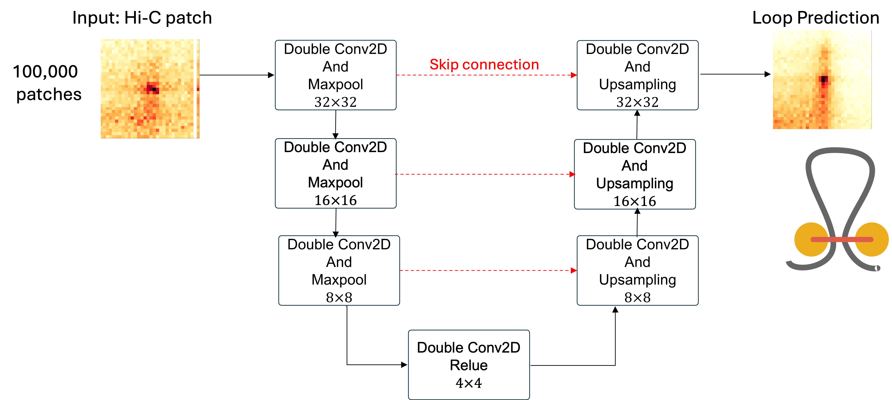

# UnetLoopDetection



**Illustration**: U-Net architecture for chromatin loop detection from Hi-C contact maps. Skip connections link encoder and decoder layers to retain fine-scale interaction patterns while integrating broader contextual features.

### Repository structure

- src/unetloopdetection: reusable python utilities (data, model, train, eval)
- notebooks: analysis notebooks (workflow)
- scripts: simple command line entrypoints
- data: put your inputs here (kept empty in git)
- outputs: training runs and predictions

### Installation and Requirements

```
git clone https://github.com/hrahmanin/UnetLoopDetection.git
```
then
```
pip install -e .
```
or
```
pip install -r requirements.txt
```

### Quick workflow

1) Make patches (creates data/train_patches.npz and data/val_patches.npz)
- open notebooks/01_make_pairs_and_patches.ipynb

2) Train
- open notebooks/02_train_unet_classifier.ipynb
or run:
python scripts/train_unet.py --config outputs/run_config.yaml --out outputs/run

3) Evaluate + plots
- open notebooks/03_evaluate_and_plots.ipynb

4) Anchor / occupancy analysis
- open notebooks/04_anchor_occupancy_analysis.ipynb

Data format used by this repo

Patch files are stored as a single .npz with:
- X: (N, H, W) or (N, C, H, W)
- y: (N, H, W) or (N, 1, H, W)


